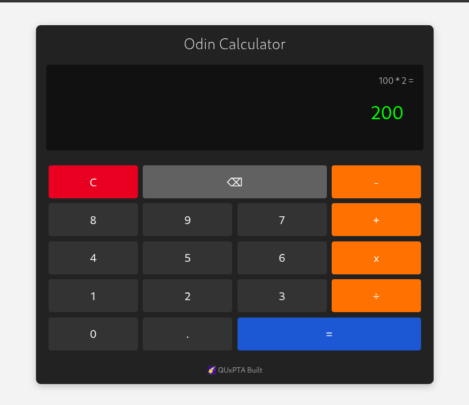

# Odin Calculator 🖩

A responsive, fully functional calculator built with HTML, CSS, and JavaScript — Final project of The Odin Project's Foundations curriculum.

## 🚀 Features

- ✅ Basic operations: add, subtract, multiply, divide
- 🧠 Maintains calculation state until cleared
- 🖱️ Interactive buttons for digits, operators, decimal, clear, backspace, and equals
- ➕ Chained calculations supported (e.g., 8 + 9 + 3)
- ⚠️ Divide-by-zero error handling
- 💡 Decimal support (with single decimal enforcement)
- 🖼️ Clean, responsive UI using Flexbox

## 📸 Preview



## 🛠️ Built With

- **HTML5**
- **CSS3**
- **JavaScript**

## 📁 Project Structure

```bash
/odin-calculator
├── index.html
├── style.css
├── calculator.js
└── README.md
```

## 🎯 Getting Started

### Online

To play the game online, just head over to this [link](https://quxpta.github.io/odin-calculator/), and play away!

### Offline

If you would like to play the game offline:

```bash
git clone https://github.com/QUxPTA/odin-calculator
cd odin-etch-a-sketch
```

Then, drop the HTML file into your browser of choice, or open using liveserver in your favorite IDE

## 🧠 Concepts Practiced

- DOM manipulation
- Event listeners
- CSS transitions
- Grid layout using Flexbox
- Dynamic user input and validation

## 🙌 Credits

This project was created as part of the Foundations Course from [The Odin Project](https://www.theodinproject.com/).
